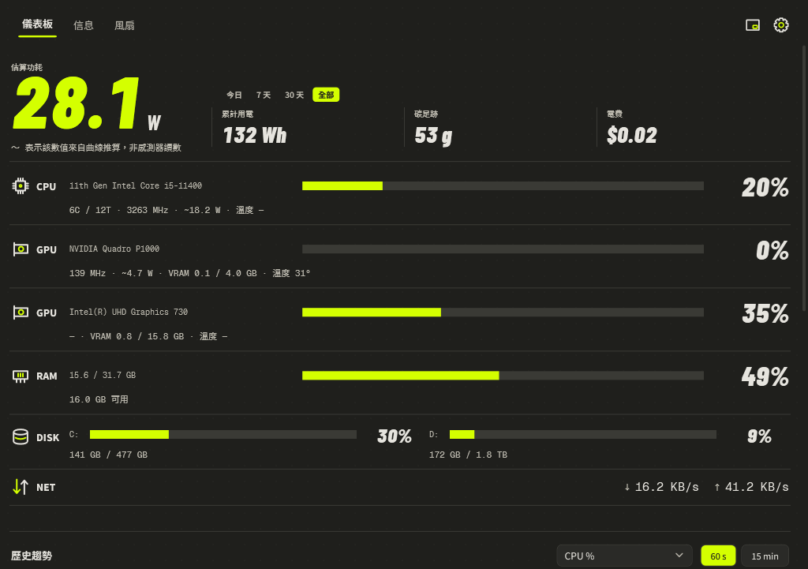

# 🦫 Momo System Monitor

**[繁體中文](README.zh-Hant.md) | English**

Full user guide (HTML, GitHub Pages):

👉 [tomideas.github.io/momo-monitor](https://tomideas.github.io/momo-monitor)



Hey — meet **Momo System Monitor**, a little Windows 11 widget that keeps an eye on your whole machine: CPU / GPU / RAM / network / storage, fans and AIO pumps, wattage, cumulative energy, carbon footprint, electricity cost, and top processes — all ticking every second.

Two skins, one rule: **color only ever means "this reading is over budget."**

## Features

- **Live dashboard** — hero number is current power draw; CPU / GPU / RAM / DISK / NET share one baseline bar list, so length alone tells the story
- **Two skins** — *Volt* (dark, neon accent) and *Paper Pop* (light, cobalt accent); same layout skeleton, instant switch, choice is remembered
- **Trends** — 60 s / 15 min charts for CPU/GPU load, RAM, VRAM, temperatures and estimated power, with min / avg / max
- **Mini window** — a 258 × 238 glance panel you can drag from anywhere; double-click to return to the main window
- **Over-limit alerts** — CPU 90 °C, GPU 85 °C, memory 90 %, disk under 10 % free by default (15 s sustained, 300 s cooldown), with an in-app alert log
- **Info page** — full hardware & system details via WMI, one card per fixed drive, copyable spec sheets
- **Per-process power** — wattage attributed to each process by CPU/GPU share
- **Portable mode** — drop a `momo-data` folder next to the exe and all data travels with it
- **Bilingual** — English / 繁體中文, switchable in settings

## Requirements

- Windows 11 (x64), [.NET 8 Desktop Runtime](https://dotnet.microsoft.com/download/dotnet/8.0)
- Runs as administrator (UAC prompt) to read hardware sensors; without it, temperature / fan / CPU watts show `—`
- Optional: **[PawnIO](https://namazso.net/pawnio.html)** driver for CPU temperature, fans and board voltages — install once with `winget install namazso.PawnIO -e`

## Build

Requires the .NET 8 SDK:

```powershell
powershell -ExecutionPolicy Bypass -File .\build.ps1
```

Output is a single `MomoMonitor.exe` (framework-dependent). `StatusMonitor\libs\` contains a self-built LibreHardwareMonitor master plus its dependencies (adds NCT6701D support, uses the signed PawnIO driver instead of the blocklisted WinRing0).

## Run & data

Double-click `MomoMonitor.exe`. Data lives in `%APPDATA%\StatusMonitor\` — `settings.json`, `totals.json` (cumulative Wh, survives reboots), `energy-history.json` (~400 days). Create a `momo-data` folder next to the exe for portable mode; existing data migrates automatically on first launch.

Headless verification:

```powershell
.\MomoMonitor.exe --dump --out snapshot.json   # one sample as JSON
.\MomoMonitor.exe --diag --out diag.txt        # list all visible sensors
.\MomoMonitor.exe --render dash.png            # render the dashboard to PNG
```

## Data sources

| Signal | Source |
|--------|--------|
| CPU | LibreHardwareMonitor (Tctl/Tdie temp, package watts, per-core clocks) |
| Fans / pumps | LibreHardwareMonitor (SuperIO, e.g. Nuvoton NCT6701D) |
| GPU | LibreHardwareMonitor (NVIDIA + AMD + Intel; temp, clocks, fan RPM, watts, load, VRAM) |
| RAM | GlobalMemoryStatusEx |
| Storage | PhysicalDisk performance counters |
| Network | NetworkInterface statistics |
| Per-process | Process API + GPU Engine counters + GetProcessIoCounters |

Wattage and per-process attribution formulas were re-implemented from [WattSeal](https://github.com/namazso/WattSeal) (GPLv3) — see the License section.

## Known limitations

- Motherboard fans / pumps come from SuperIO — support depends on your board's chip being covered by LibreHardwareMonitor
- GPUs without fan sensors (e.g. integrated) show `—` for fan speed
- The single-file exe is framework-dependent — the target machine needs the .NET 8 Desktop Runtime

## Design docs

- [Architecture, formulas, acceptance](dev/docs/2026-09-12-status-monitor-design.md)
- [UI redesign — light neo-brutalism](dev/docs/2026-09-12-status-monitor-ui-redesign.md)
- [VOLT / PAPER POP spec](dev/docs/2026-09-13-volt-paper-pop.md)

Previews: [Paper Pop dashboard](dev/docs/previews/paper-dashboard.png) · [Info page](dev/docs/previews/paper-info.png) · [Settings](dev/docs/previews/volt-settings.png) · [Mini mode](dev/docs/previews/features-mini.png) · [Live trends](dev/docs/previews/features-trend-live.png)

## License

[GPL-3.0](LICENSE) — the power-estimation and per-process attribution formulas are re-implemented from WattSeal (GPLv3), so the project is released under GPL-3.0.
