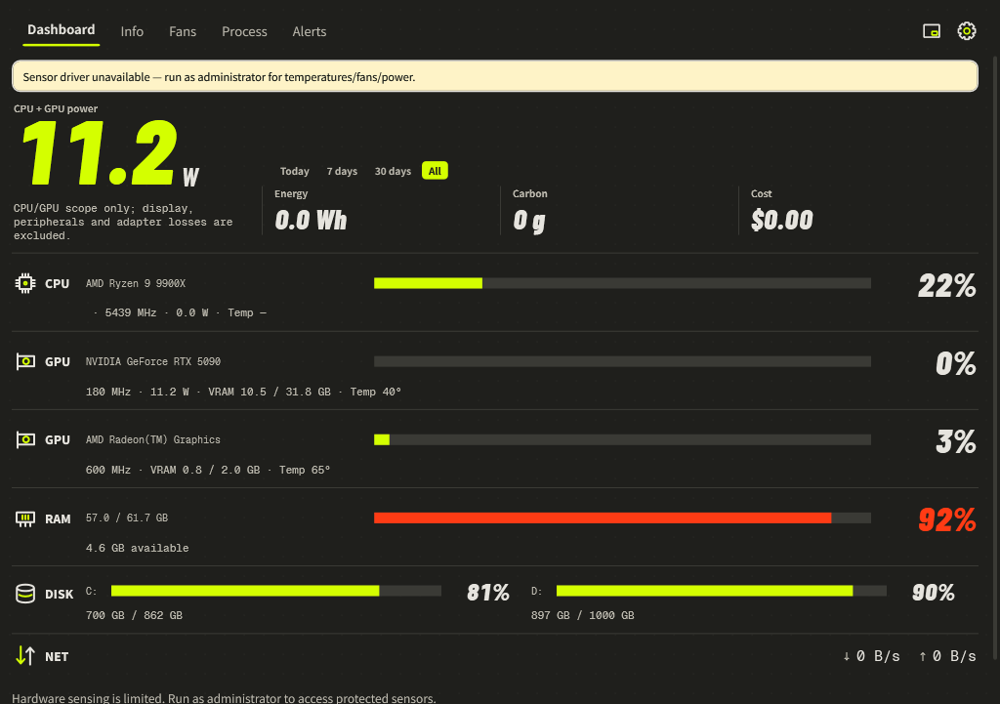

# Momo System Monitor

**[中文](README.zh-Hant.md) | English**

Full user guide (HTML, GitHub Pages):

👉 [tomideas.github.io/momo-monitor](https://tomideas.github.io/momo-monitor)



Hey — meet **Momo System Monitor**, a little Windows 11 widget that keeps an eye on your whole machine: CPU / GPU / RAM / network / storage, fans and AIO pumps, wattage, cumulative energy, carbon footprint, electricity cost, and top processes — all ticking every second.

Two skins, one rule: **color only ever means "this reading is over budget."**

## What's new in 0.1.6

- **Named temperature readings:** dashboard and CPU fan monitoring share the CPU temperature resolver. Invalid readings no longer hide a valid fallback, and distance-to-TjMax is never presented as an absolute temperature. GPU core, hot spot and memory-junction readings keep their own names and units when supported.
- **Power scopes stay separate:** one whole-GPU power domain is selected instead of summing board, core and rail readings. Integrated-GPU power is not added again to CPU package power; a reported 0 W remains a valid reading.
- **Conservative notebook support:** notebooks and an unknown chassis do not inherit desktop TDP/peripheral/PSU curves. On AC, the labelled CPU + GPU scope uses available telemetry or explicitly supplied GPU calibration. On battery, a valid Windows discharge rate represents battery-side machine power. Charging W is shown separately and never counted as consumption.
- **Energy follows valid monitoring:** suspend/resume and long sampling gaps break integration; sleeping hours are not filled with the last awake wattage. The energy note shows monitored time, missing-power time and the measurement scope; old history remains readable.
- **Compare sensor sources:** expand sensor details and export the current sample as a local UTF-8 CSV with sensor names/IDs, units, scopes, current/min/max values, reading states, sample time and the bundled library fingerprint. The report collects no host name or hardware serial numbers.

Hardware coverage still depends on the firmware and LibreHardwareMonitor. See the [cross-computer comparison protocol](dev/docs/temperature-power-validation.md); notebook accuracy has not yet been established on physical test machines.

## Previous improvements in 0.1.5

- **Fans show the complete picture:** temperature and its source stay visible in Auto and Custom; each fan reports who controls it, whether a custom command took effect, and whether RPM is stopped or unavailable.
- **Inspect a reading directly:** select CPU/GPU for temperature trends, RAM for memory trends and memory-ranked processes, or DISK for processes ranked by disk activity. GPU inspection keeps your primary-GPU alert preference intact.
- **Understand missing data:** stale samples, limited privileges, missing drivers and unavailable sensors have explicit explanations, with retry and monitoring-setting actions. Missing values are never substituted with zero.
- **Follow up an alert:** the Alerts page keeps seven days of events across restarts, including recovery, duration, peak/lowest value and acknowledgement. Notifications open their event; select **View related readings** to investigate.
- **Distribute a portable folder:** no .NET installation for the standard release. Data stays in `momo-data`, storage problems are visible and backups are recoverable. Moving to a different PC retains histories and returns fan control to Auto.

## Features

- **Live dashboard** — hero number is current power draw; CPU / GPU / RAM / DISK / NET share one baseline bar list, so length alone tells the story
- **Two skins** — *Volt* (dark, neon accent) and *Paper Pop* (light, cobalt accent); same layout skeleton, instant switch, choice is remembered
- **Trends** — 60 s / 15 min charts for CPU/GPU load, RAM, VRAM, temperatures and estimated power, with min / avg / max
- **Mini window** — a 258 × 238 glance panel you can drag from anywhere; double-click to return to the main window
- **Over-limit alerts** — CPU 90 °C, GPU 85 °C, memory 90 %, disk under 10 % free by default (15 s sustained, 300 s cooldown), with seven days of persistent events and acknowledgement
- **Info page** — full hardware & system details via WMI, one card per fixed drive, copyable spec sheets
- **Per-process power** — wattage attributed to each process by CPU/GPU share
- **Portable package** — bundled .NET runtime, an empty `momo-data` folder, atomic saves and recoverable history; move the complete folder to keep your data
- **Bilingual** — English / 中文, switchable in settings

## Requirements

- Windows 11 (x64); the standard portable release includes .NET, so users do not install a runtime
- Runs as administrator (UAC prompt) to read hardware sensors; without it, temperature / fan / CPU watts show `—`
- CPU temperature, CPU package power and board fan speeds need a kernel driver, which no Windows program can do without. Momo carries the signed [PawnIO](https://pawnio.eu/) installer and offers to install it once, on the first start of a machine that needs it — see [Sensor driver](#sensor-driver) below

## Build

Requires the .NET 8 SDK:

```powershell
powershell -ExecutionPolicy Bypass -File .\build.ps1
```

The default build updates only the self-contained Windows x64 `MomoMonitor.exe` at the repository root. It does not create a distribution folder or ZIP.

When packaging is explicitly requested, run `powershell -ExecutionPolicy Bypass -File .\build.ps1 -Portable`. This produces `dist/MomoMonitor-Portable-win-x64/` and its ZIP with the executable, guide, licence and an empty `momo-data/`. Local settings and histories are never packaged.

Use `-Test` for a separately named, non-elevated test executable. `-FrameworkDependent` is an optional smaller developer build whose target PC needs the .NET 8 Desktop Runtime. `-KeepWork` retains build staging for debugging; otherwise only verified build temporary directories are cleaned. A populated distribution folder is never deleted or overwritten: move it aside before explicitly packaging.

If the root executable is locked, the build reports that it was not updated and never closes the running app. Exit Momo before replacing or starting the new version. Explicit `-Portable` packaging can still complete even when the root file cannot be replaced.

Restore uses `StatusMonitor/NuGet.Config`; build-only AppData and NuGet packages are isolated in `dev/.build-env/`. The first self-contained build needs access to NuGet to obtain the Windows x64 runtime packages if they are not cached. The caller's AppData setting is restored when the script ends.

`StatusMonitor\libs\` contains a self-built LibreHardwareMonitor master plus its dependencies (adds NCT6701D support, uses the signed PawnIO driver instead of the blocklisted WinRing0).

## Sensor driver

CPU temperature, CPU package power and motherboard fan speeds can only be read through a kernel driver — nothing in user mode reaches a model-specific register or the LPC bus, administrator or not. Tools that appear to need no driver ship their own inside their installer.

Momo embeds the official signed [PawnIO](https://pawnio.eu/) installer, unmodified, as its own licence permits. On the first start of a machine that cannot read those sensors it asks once; installing is silent (`-install -silent`), needs no Windows restart, and Momo reopens itself so the driver is loaded. Declining is remembered, and the same offer stays on Settings → Monitoring & alerts for as long as the driver is missing. Installing it by hand with `winget install namazso.PawnIO -e` does the same thing.

PawnIO replaced WinRing0, which Microsoft's vulnerable-driver blocklist refuses to load; the hardware modules it runs (`IntelMSR`, `LpcIO`) ship inside LibreHardwareMonitor. It is GPL-2.0, © namazso, [github.com/namazso/PawnIO](https://github.com/namazso/PawnIO).

If fans are still `—` with the driver installed, that board's SuperIO chip is not in LibreHardwareMonitor's supported list (common on OEM prebuilts). `.\MomoMonitor.exe --diag diag.txt` shows whether anything is listed under `[Motherboard]`.
## Run & data

Extract the **complete portable folder** to a writable local location, then double-click `MomoMonitor.exe`. Keep `momo-data` next to the executable. Settings shows the actual data location and storage status. Do not run from inside the zip; exit Momo before copying, updating or backing up the folder.

| Data file | Contents |
|---|---|
| `settings.json` | Preferences and a one-way machine marker |
| `totals.json` | Cumulative energy in Wh, retained across restarts |
| `energy-history.json` | Daily energy history, approximately 400 days |
| `alert-history.json` | Recent alert events, including recovery information |

JSON saves are atomic and retain the previous version as `.bak`. If a file is damaged, Momo attempts its backup, reports recovery and preserves the damaged original. If no valid copy exists, the original is protected from default-value saves. Failed writes are reported; Momo never silently changes a read-only portable folder to AppData. Move the **complete folder** somewhere writable and restart.

On a new PC, general preferences and histories are retained. Fan profiles return to firmware Auto; fan labels/sources, GPU selection, power calibration, Windows startup/mini-start preferences and window positions are reset. Legacy settings without a machine marker receive the same one-time safety reset. Confirm hardware settings again on that machine before enabling custom control.

For compatibility, removing `momo-data` deliberately selects `%APPDATA%\StatusMonitor\`. An empty portable data folder imports an existing AppData set once; any existing portable data prevents merging the two sets. The old AppData files remain intact.

Settings → General → **Start with Windows** registers a Task Scheduler logon task that runs with the highest available privileges, about 20 seconds after you sign in. An elevated app cannot be started quietly from the Run key or the Startup folder, so this is the route that starts it without a UAC prompt at every sign-in; clearing the box removes the task, and setting it requires Momo itself to be running as administrator.

The driver and logon task are installations on the current PC, even when the application data is portable. Disable **Start with Windows** before deleting a portable copy from that PC. Moving the folder within the same PC updates an enabled task when Momo is next started.

Headless verification:

```powershell
.\MomoMonitor.exe --dump --out snapshot.json   # one sample as JSON
.\MomoMonitor.exe --diag diag.txt             # list all visible sensors
.\MomoMonitor.exe --render dash.png            # render the dashboard to PNG
```

## Data sources

| Signal | Source |
|--------|--------|
| CPU | LibreHardwareMonitor (Tctl/Tdie temp, package watts, per-core clocks) |
| Fans / pumps | LibreHardwareMonitor (SuperIO, e.g. Nuvoton NCT6701D) |
| GPU | LibreHardwareMonitor (NVIDIA + AMD + Intel; temp, clocks, fan RPM, watts, load, VRAM) |
| Battery | Windows battery API: AC state, charge percentage and signed absolute charge/discharge rate; unsupported or relative rates remain unavailable |
| RAM | GlobalMemoryStatusEx |
| Storage | PhysicalDisk performance counters |
| Network | NetworkInterface statistics |
| Per-process | Process API + GPU Engine counters + GetProcessIoCounters |

Wattage and per-process attribution formulas were re-implemented from [WattSeal](https://github.com/namazso/WattSeal) (GPLv3) — see the License section.

## Known limitations

- Motherboard fans / pumps come from SuperIO — support depends on your board's chip being covered by LibreHardwareMonitor
- GPUs without fan sensors (e.g. integrated) show `—` for fan speed
- Sensor coverage is not identical to HWMonitor. Unsupported hot spot/memory-junction values remain `—`; measured CPU + GPU power on a notebook excludes the screen, memory and other components. Battery discharge is battery-side power; AC input still requires a wall meter for a physical measurement.
- Battery rate aggregation requires every system battery to expose valid absolute units and the same charge/discharge direction. UPS devices, missing packs and relative units are not treated as notebook machine power.
- Existing energy records retain their original figures; legacy records lack monitoring-coverage metadata. Current totals count valid monitoring intervals and can contain different labelled measurement scopes across AC/battery operation.
- Portable data requires a writable folder. Optional PawnIO installation and Windows startup registration affect the current PC and do not move with the application folder.

## Design docs

- [Architecture, formulas, acceptance](dev/docs/2026-09-12-status-monitor-design.md)
- [UI redesign — light neo-brutalism](dev/docs/2026-09-12-status-monitor-ui-redesign.md)
- [VOLT / PAPER POP spec](dev/docs/2026-09-13-volt-paper-pop.md)

Previews: [Paper Pop dashboard](dev/docs/previews/paper-dashboard.png) · [Info page](dev/docs/previews/paper-info.png) · [Settings](dev/docs/previews/volt-settings.png) · [Mini mode](dev/docs/previews/features-mini.png) · [Live trends](dev/docs/previews/features-trend-live.png)

## License

[GPL-3.0](LICENSE) — the power-estimation and per-process attribution formulas are re-implemented from WattSeal (GPLv3), so the project is released under GPL-3.0.
